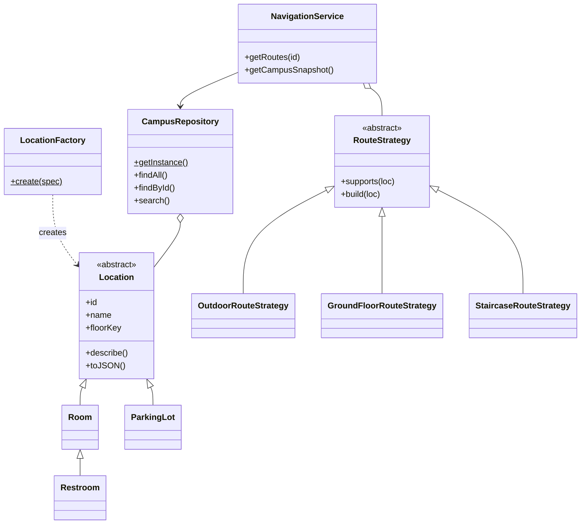

# ICT-U Multi-Level Campus GPS

A 3D campus navigation system for ICT-U. Pick a hall, room or restroom, and the app draws the route from the Main Gate (up the spiral staircase if needed) and animates a marker along it, with step-by-step text directions.

## Features

- Home page and About Us page (project overview and team)
- 3D campus model: perimeter wall, main gate, parking lot behind the school, central spiral staircase, and six floors (-1 to 5)
- Destination dropdown grouped by floor, plus a "Show Floor" filter
- Animated route with a moving marker and text directions
- REST API for floors, locations, routes and search
- Automated tests and a CI/CD pipeline

## Tech stack

- Node.js 18+ and Express
- Three.js (loaded from a CDN, so the 3D page needs an internet connection)
- Node's built-in test runner (`node --test`)
- GitHub Actions and Docker

## Getting started

### Prerequisites
- Node.js 18 or newer
- npm

### Install and run
```bash
npm install
npm start
```
Open http://localhost:3000

| Page | URL |
|---|---|
| Home | `/` |
| About Us | `/about` |
| Campus Navigation (3D) | `/navigate` |

The team photos must be saved as `public/images/Charles.jpeg` and `public/images/Rosaline.jpeg`.

### Run the tests
```bash
npm test
```

### Run with Docker
```bash
docker build -t ictu-campus-gps .
docker run -p 3000:3000 ictu-campus-gps
```

## Project structure

```
ictu-campus-gps/
├── server.js                  # application (models, patterns, API, 3D page)
├── pages.js                   # Home and About Us pages
├── package.json
├── public/images/             # team photos
├── test/server.test.js        # unit, page and API tests
├── .github/workflows/ci.yml   # CI/CD pipeline
├── Dockerfile
├── .dockerignore
├── .gitignore
├── README.md
└── REQUIREMENTS.md
```

## API endpoints

All endpoints are `GET` and return JSON.

| Endpoint | Description |
|---|---|
| `/api/health` | Service status and uptime |
| `/api/campus` | Everything the 3D client needs (config, floors, locations, routes) |
| `/api/floors` | List of floors with their heights |
| `/api/locations` | All locations. Filters: `?floor=3`, `?type=Hall` |
| `/api/locations/:id` | One location, e.g. `/api/locations/library` |
| `/api/locations/:id/routes` | Route and text directions to a location |
| `/api/search?q=` | Search locations by name or type |

Status codes: `200` success, `400` missing `q` on search, `404` unknown location or endpoint, `500` unexpected server error.

Example:
```bash
curl http://localhost:3000/api/locations/chapel/routes
```

## Architecture

### OOP principles
- **Encapsulation:** `Location` stores its data in a private, frozen field and exposes it through getters.
- **Abstraction:** `Location` and `RouteStrategy` are abstract and cannot be used directly.
- **Inheritance:** `Room`, `Restroom` and `ParkingLot` extend `Location`.
- **Polymorphism:** `describe()`, `isOutdoor` and `opacity` behave differently per subclass.

### Design patterns
| Pattern | Where |
|---|---|
| Factory | `LocationFactory` creates the right `Location` subclass from a plain spec |
| Singleton | `CampusRepository.getInstance()` |
| Repository | `CampusRepository` is the only place that stores and queries locations |
| Strategy | `OutdoorRouteStrategy`, `GroundFloorRouteStrategy`, `StaircaseRouteStrategy` |
| Facade | `NavigationService` gives the API one simple entry point |
| Dependency Injection | `NavigationService` receives its repository and strategies through the constructor |

### Class diagram


## CI/CD

The pipeline is defined in `.github/workflows/ci.yml`.

- **CI:** on every push and pull request, GitHub Actions installs dependencies and runs `npm test` on Node 18, 20 and 22.
- **CD:** when the tests pass on `main`, the pipeline builds the Docker image and publishes it to GitHub Container Registry (`ghcr.io`).

The pipeline only runs once the project is pushed to a GitHub repository.

## Campus layout

| Floor | Contents |
|---|---|
| -1 | Pondi Hall, Campus Cantine |
| 1 | Campus Sickbay, George Mbarika Hall, Administration Office, Central Library, Staff Toilets |
| 2 | Chumbow Hall, Terry & Lynda Hall, Computer Lab, Cisco Lab, Girls' Restroom |
| 3 | Gaming Hall, Department, French Hall 3, Eric Mbarika Hall, French Hall 2, Boys' Restroom |
| 4 | VC Office, Staff Offices, Disciplinary Council, Finance Office, Staff Toilets |
| 5 | University Chapel |
| Outdoor | Campus Parking Lot (behind the school, inside the fence) |

## Limitations

- Room sizes and positions are estimates and may not match the real campus exactly.
- Each location has one route.
- The API is read-only.
- Campus data is held in memory (no database).

## Authors

- Nyetam Bassong Charles: Scrum Master & Developer
- Imouck Njoh Rosaline: Product Owner & Developer